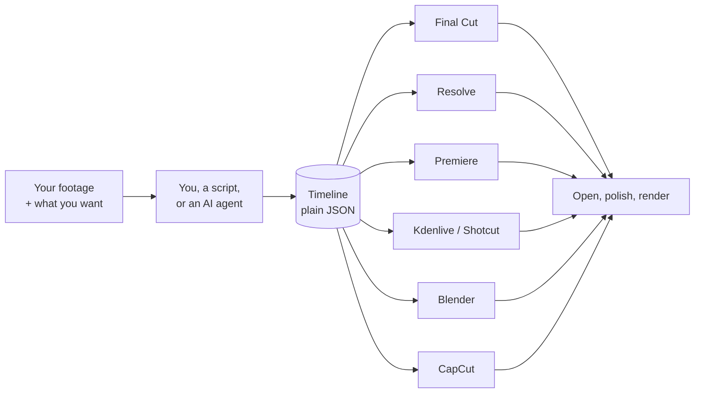
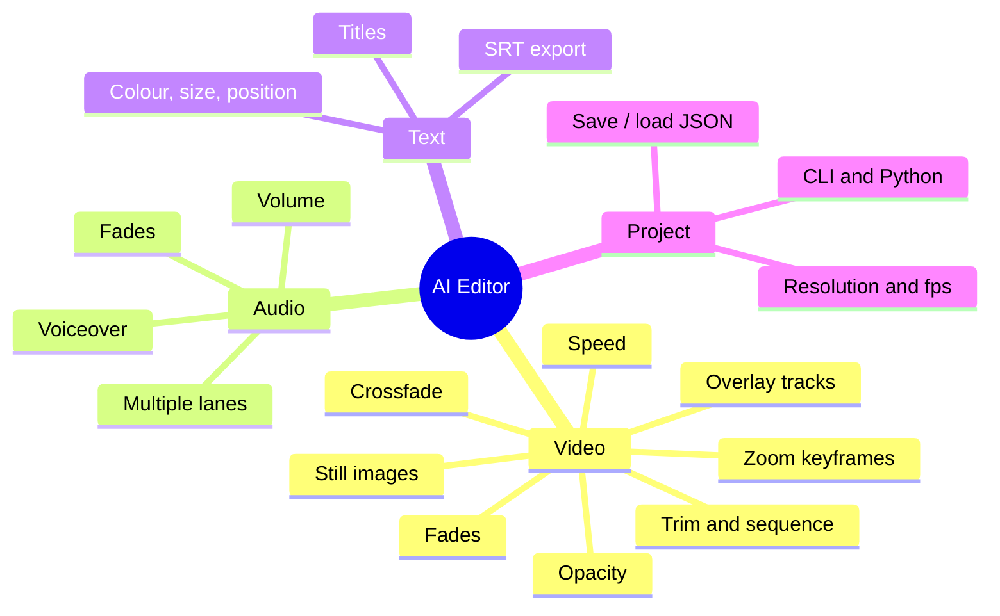
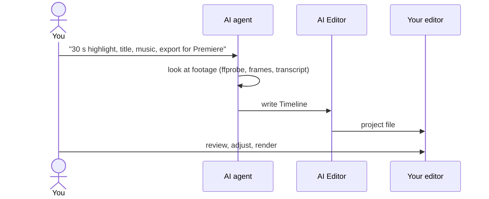

# AI Editor

**Describe an edit once. Open it in Final Cut, Resolve, Premiere, Kdenlive, Shotcut, Blender or CapCut.**

<p align="center">
<a href="#how-it-works">How it works</a> ·
<a href="#editors">Editors</a> ·
<a href="#features">Features</a> ·
<a href="#ai-agent">AI agent</a> ·
<a href="#quick-start">Quick start</a> ·
<a href="#api">API</a> ·
<a href="#open-in-your-editor">Open in editor</a> ·
<a href="#voiceover">Voiceover</a> ·
<a href="#testing">Testing</a> ·
<a href="#faq">FAQ</a> ·
<a href="#credits">Credits</a>
</p>

```python
tl = Timeline("demo")
tl.add_clip("interview.mp4", dur=8, src=12, fade_in=0.5)
tl.add_clip("broll.mp4", dur=5, crossfade=1)
tl.add_audio("music.mp3", volume=0.4, fade_out=2)
tl.add_title("Opening scene", start=1, dur=3, fade=0.5)
export(tl, "fcp", "out")        # out/demo.fcpxml
```

## How it works



Your footage is never touched. The project file only says which part of which file plays where.
**You or your agent decide the cuts. This project writes the project file.**

## Editors

| Editor | Output | Tested |
|---|---|:-:|
| Final Cut Pro | `.fcpxml` | 🟡 |
| DaVinci Resolve | `.fcpxml` + import script | 🟡 |
| Premiere Pro | `.xml` + `.srt` | 🟡 |
| Kdenlive / Shotcut | `.mlt` | 🟢 |
| Blender | `.py` | 🟢 |
| CapCut | draft folder | 🟡 |

🟢 rendered and measured &nbsp; 🟡 file checked, not opened in the app. iMovie and Filmora can't import a timeline, so they're not supported.

## Features



Every editor supports every feature. A test fails if one doesn't.

| Feature | Final Cut | Resolve | Premiere | Kdenlive / Shotcut | Blender | CapCut |
|---|:-:|:-:|:-:|:-:|:-:|:-:|
| Trim, sequence, tracks | ✓ | ✓ | ✓ | ✓ | ✓ | ✓ |
| Volume, speed, opacity | ✓ | ✓ | ✓ | ✓ | ✓ | ✓ |
| Fades, crossfade | ✓ | ✓ | ✓ | ✓ | ✓ | ✓ ¹ |
| Titles | ✓ | ✓ | ✓ | ✓ | ✓ | ✓ |
| Zoom keyframes | ✓ | ✓ | ✓ | ✓ | ✓ | ✓ |
| Still images | ✓ | ✓ | ✓ | ✓ | ✓ | ✓ |

¹ Pictures only. For audio, use separate tracks with `fade_in`/`fade_out`.

**Not included:** effects, filters, colour grading, other transitions (each editor has its own), font choice and text animation, and reading existing projects. Media is referenced by absolute path, so moving it means re-linking in the editor.

## AI agent

Not a chat app, but any coding agent (Claude Code, Codex, Cursor) can drive it, because an edit is just a few lines of Python or a JSON file.



The agent can only cut on what it can see or hear. Give it a transcript or notes for best results.

**Try saying**
> "Cut `~/footage/trip.mp4` to 30 seconds with a title, and export for Premiere."
> "Add `song.mp3` quietly under the clips and dissolve between them."
> "Zoom in on each click at 3.2 s, 7.8 s and 12.5 s, then export for Resolve."

**Not built yet:** a ready-made agent instruction file, and helpers for transcription and scene detection.

## Quick start

**Needs:** Python 3.10+, [ffmpeg](https://ffmpeg.org) (`brew install ffmpeg`). The editor is only needed to open the result.

```bash
git clone https://github.com/zandy700/AI-Editor.git && cd AI-Editor
python3 -m venv .venv && source .venv/bin/activate
pip install -e .                     # core
pip install -e '.[narrate,capcut]'   # optional: voiceover, CapCut
```

Make two test clips, then export:

```bash
ffmpeg -f lavfi -i testsrc=duration=10:size=1280x720:rate=30 -f lavfi -i sine=duration=10 -shortest -pix_fmt yuv420p a.mp4
ffmpeg -f lavfi -i smptebars=duration=10:size=1280x720:rate=30 -f lavfi -i sine=frequency=330:duration=10 -shortest -pix_fmt yuv420p b.mp4
```

```python
from editor import Timeline
from editor.export import export

tl = Timeline("demo")
tl.add_clip("a.mp4", dur=4, src=2, fade_in=0.5)
tl.add_clip("b.mp4", dur=4, crossfade=1)
tl.add_title("Hello", start=1, dur=2, fade=0.5)
export(tl, "fcp", "out")            # or premiere, resolve, kdenlive, shotcut, blender, capcut
```

Command line, from a saved timeline:

```bash
python -m editor export timeline.json fcp premiere -o out
python -m editor export timeline.json all -o out
```

## API

`Timeline(name="Edit", width=1920, height=1080, fps=30)`. All times are in **seconds**.

```
 track 1 (overlay)   ░░░░░ watermark ░░░░░░░░░░░░░░░░░░░░░░
 track 0 (main)      ▓▓▓ a.mp4 ▓▓▓▓▓▓╲╱▓▓▓▓ b.mp4 ▓▓▓▓▓▓▓▓▓
                                      ↑ crossfade overlap
 title                    [ Hello ]
 audio 0             ♪♪♪♪♪♪♪♪♪♪ music.mp3 ♪♪♪♪♪♪♪♪♪♪♪♪♪♪
 time  0s ───────────────────────────────────────────────▶
```

| Method | Does |
|---|---|
| `add_clip(path, dur, src, start, track, **opts)` | Video or still image |
| `add_audio(path, dur, src, start, track, **opts)` | Audio on a lane |
| `add_title(text, start, dur, **opts)` | On-screen text |
| `save(path)` / `Timeline.load(path)` | JSON round trip |
| `srt()` | Titles as subtitles |

Defaults that keep scripts short: `start` is the end of the track, so repeated `add_clip` calls chain; `dur` is the rest of the file (**stills need `dur`**); `track=0` is the main video.

| Clip option | Default | Meaning |
|---|---|---|
| `src` | 0 | Trim: in-point in the file |
| `volume` | 1.0 | Sound level |
| `speed` | 1.0 | 2.0 = twice as fast. `dur` is the length on the timeline, so a 2× clip with `dur=2` uses 4 s of the file |
| `opacity` | 1.0 | Picture transparency |
| `fade_in` / `fade_out` | 0 | Seconds. Picture fades from/to black (transparent on overlays) and sound from/to silence |
| `crossfade` | 0 | Seconds. Overlaps the previous clip on its track and dissolves across the overlap. `start` is set for you (previous end − crossfade), so the timeline gets shorter. Main video track only |
| `zoom` | [] | `[(seconds_into_clip, scale), …]`, 1.0 = no zoom. Usually set by `apply_click_zoom` |
| `track` | 0 | Video: 0 = main, 1+ = overlays on top. Audio: lane number |

| Title option | Default | Meaning |
|---|---|---|
| `y` | -0.8 | -1 bottom to 1 top (default is subtitle position) |
| `size` | 60 | Pixels at 1080p |
| `color` | `#ffffff` | Hex |
| `fade` | 0 | Fade in/out seconds |

**Click zoom** for screen recordings:

```python
from editor.zoom import apply_click_zoom
rec = tl.add_clip("screen.mp4")
apply_click_zoom(rec, [3.2, 7.8, 12.5], scale=1.5)   # times in seconds from clip start, or a JSON file of times
```

`scale=1.5` zoom factor, `ramp=0.25` seconds to zoom in/out, `hold=0.6` seconds to stay zoomed.

**JSON** (write it from any language, or have an LLM produce it). `tl.save("timeline.json")` and `Timeline.load(...)` round-trip the whole edit. Use absolute paths. `start` is required on every clip in JSON.

```json
{
  "name": "demo", "width": 1920, "height": 1080, "fps": 30,
  "clips": [
    {"path": "/abs/path/a.mp4", "start": 0, "dur": 4, "src": 2, "kind": "video", "track": 0,
     "volume": 1.0, "speed": 1.0, "opacity": 1.0, "fade_in": 0.5, "fade_out": 0.0,
     "crossfade": 0.0, "zoom": []},
    {"path": "/abs/path/music.mp3", "start": 0, "dur": 8, "src": 0, "kind": "audio", "track": 0,
     "volume": 0.5, "speed": 1.0, "opacity": 1.0, "fade_in": 1.0, "fade_out": 2.0,
     "crossfade": 0.0, "zoom": []}
  ],
  "titles": [
    {"text": "Hello", "start": 1, "dur": 2, "y": -0.8, "size": 60, "fade": 0.5, "color": "#ffffff"}
  ]
}
```

## Open in your editor

| Editor | Files | How |
|---|---|---|
| Final Cut | `Name.fcpxml` | File → Import → XML. A new event named after the timeline appears |
| Resolve | `Name.fcpxml`, `Name.resolve.py` | File → Import → Timeline, or run the script (below) |
| Premiere | `Name.premiere.xml`, `Name.srt` | File → Import. If you have titles, import the `.srt` and drag it on as captions, in case Premiere drops the XML titles |
| Shotcut | `Name.mlt` | File → Open File |
| Kdenlive | `Name.mlt` | File → Open. If it refuses, open in Shotcut or render with `melt` |
| Blender | `Name.blender.py` | See below |
| CapCut | folder `Name/` | Export into CapCut's drafts folder, restart CapCut |

**Resolve script**, with Resolve running:

```bash
python3 out/Name.resolve.py                    # import the timeline
python3 out/Name.resolve.py --render ~/Movies  # import, then queue and run a render
```

Enable *DaVinci Resolve → Preferences → System → General → External scripting using: Local*. Some versions limit scripting to Studio. Importing the `.fcpxml` by hand always works.

**Blender** (5.x tested):

```bash
blender -b --python out/Name.blender.py                         # build only
blender -b --python out/Name.blender.py -- --render video.mp4   # build and render
```

macOS executable: `/Applications/Blender.app/Contents/MacOS/Blender`. Run without `-b` to edit by hand in the Video Editing workspace.

**CapCut** (`pip install -e '.[capcut]'`). Pass the full drafts path:

```python
export(tl, "capcut", "/Users/you/Movies/CapCut/User Data/Projects/com.lveditor.draft")              # macOS
export(tl, "capcut", r"C:\Users\you\AppData\Local\CapCut\User Data\Projects\com.lveditor.draft")   # Windows
```

The location differs between versions, and newer versions may encrypt drafts and refuse them.

**No editor at all:** render the MLT file with [`melt`](https://www.mltframework.org) (`brew install mlt`):

```bash
melt out/Name.mlt -consumer avformat:video.mp4 vcodec=libx264 acodec=aac
```

## Voiceover

```python
from editor.narrate import narrate
narrate(tl, "Welcome back. Today we cut a short film.")
narrate(tl, "这是一个中文句子。", start=12)    # Chinese picks the Chinese voice
```

Each sentence is spoken, placed on the timeline, and gets a subtitle of the same length.

| Option | Default |
|---|---|
| `voice` | `en-US-AriaNeural` |
| `zh_voice` | `zh-CN-XiaoxiaoNeural` |
| `start` | after existing audio |
| `gap` | 0.1 s between sentences |
| `out_dir` | temp folder. **Pass one you keep**, the exported project points at those mp3s |

Needs `pip install -e '.[narrate]'` and internet. It uses [`edge-tts`](https://github.com/rany2/edge-tts), which calls Microsoft's read-aloud service. That service is unofficial and could change or stop, so don't build anything critical on it.

## Testing

| Target | Checked by |
|---|---|
| 🟢 Kdenlive / Shotcut | Rendered with `melt`; colours, timing, titles, audio levels measured |
| 🟢 Blender | Rendered headless in Blender 5.2; same measurements |
| 🟡 Final Cut, Resolve, Premiere, CapCut | Valid file, references resolve, times frame-aligned. **Never opened in the real app** |

Not opened in the real apps means some details are unconfirmed: Final Cut's title template ID and `timeMap`, Premiere's effect IDs and text generator. Resolve may ignore speed changes, keyframed fades or title styling. If an export looks wrong, [open an issue](https://github.com/zandy700/AI-Editor/issues) with the editor, version, screenshot and your timeline `.json`.

```bash
pip install -e '.[narrate,capcut]'
for t in tests/test_*.py; do python "$t"; done
```

```
editor/
  timeline.py   model + media probing
  narrate.py    voiceover + subtitles
  zoom.py       click zoom
  export/       fcpxml, resolve, premiere, mlt, blender, capcut
tests/          one file per exporter, plus features.py (shared full-feature timeline)
```

Add an editor: write `editor/export/<name>.py` with `SUPPORTS = set(FEATURES)` and `export(timeline, out_dir)`, register it in `editor/export/__init__.py`, add a test.

## FAQ

- **Can't see the project?** Import the file as shown in [Open in your editor](#open-in-your-editor). For CapCut, restart the app.
- **Footage missing?** Paths are absolute. Re-link if you moved it.
- **Looks wrong?** Open an issue (see Testing).

## License

[MIT](LICENSE)

---

## Credits

This project was inspired by [**jianying-editor-skill**](https://github.com/luoluoluo22/jianying-editor-skill), an AI skill that builds video edits for JianYing from plain-language requests. Its idea of letting an AI agent write the timeline is what AI Editor carries over to other editors. No code was copied. Thank you to the people who built it:

<table>
  <tr>
    <td align="center">
      <a href="https://github.com/luoluoluo22">
        <br />
        <sub><b>luoluoluo22</b></sub>
      </a><br />
      <sub>Project author / Maintainer</sub>
    </td>
    <td align="center">
      <a href="https://github.com/twodogegg">
        <br />
        <sub><b>twodogegg</b></sub>
      </a><br />
      <sub>macOS compatibility / ffprobe fallback / unit tests</sub>
    </td>
    <td align="center">
      <a href="https://github.com/shaozheliu">
        <br />
        <sub><b>shaozheliu</b></sub>
      </a><br />
      <sub>Missing-media fix / self-contained assets</sub>
    </td>
    <td align="center">
      <a href="https://github.com/Maxinsomnia">
        <br />
        <sub><b>Maxinsomnia</b></sub>
      </a><br />
      <sub>macOS 5.9+ execution support</sub>
    </td>
  </tr>
</table>

The optional CapCut export uses [**pyJianYingDraft**](https://github.com/GuanYixuan/pyJianYingDraft) by [GuanYixuan](https://github.com/GuanYixuan) (Apache-2.0), installed as a separate dependency.
